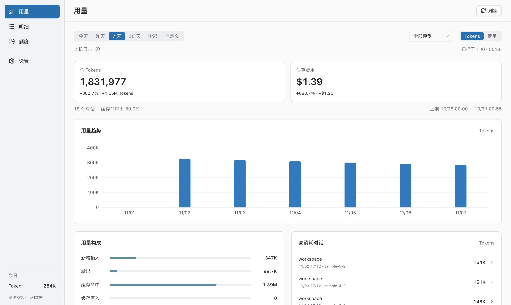
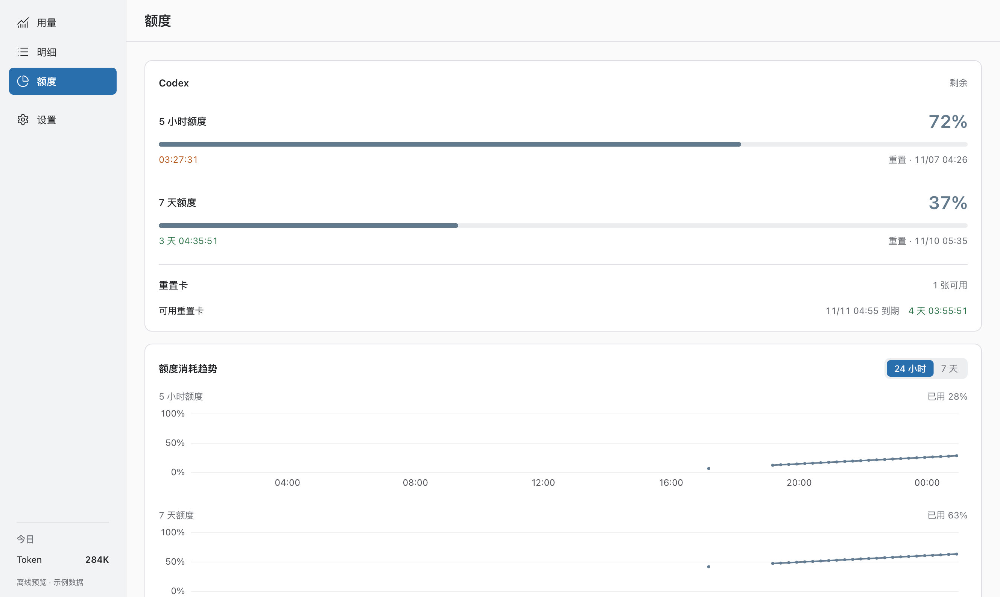

# Codex Quota

Codex Quota 是支持 Codex 与 Antigravity（反重力）的桌面额度与本地用量分析工具，支持 macOS 和 Windows。

[官网与下载](https://sunpm.github.io/codex-quota/) · [使用说明](https://sunpm.github.io/codex-quota/usage/)

- 查看 Codex 与 Antigravity 的剩余额度和重置倒计时，按服务独立监测。
- 查看 Codex 各窗口的今日已用比例和额度趋势，以及账号的 Credits 余额和重置卡。可按窗口设置低额度提醒，也可接收额度恢复、重置前和重置卡到期提醒。
- 按服务、时间、模型、对话和项目分析 Codex 与 Antigravity Token 用量及估算费用，支持按服务自定义价格。
- 查看用量趋势、缓存命中率、热力图、全局逐条记录与费用拆分。
- 在菜单栏或系统托盘查看额度，关闭窗口后继续监测，退出应用后停止。
- 查看两项服务的 AIHOT 公开重置动态，经确认后安装应用更新。

<picture>
  <source media="(prefers-color-scheme: dark)" srcset="docs/images/usage-dark.png">
  
</picture>

查看额度监测截图

<picture>
  <source media="(prefers-color-scheme: dark)" srcset="docs/images/quota-dark.png">
  
</picture>

Codex 额度监测复用官方 CLI 登录态。Antigravity 监测默认关闭，开启后可选择 IDE 本地快照、独立桌面 App 的额度面板或官方 CLI。用量分析可独立使用，只读本机 Codex 日志、Antigravity CLI / 桌面端 JSONL 与 SQLite，以及已确认口径的采集历史，可能包含多个账号。费用按 API 单价估算，**不代表订阅账单**。

[版本历史](CHANGELOG.md) · [反馈问题](https://github.com/sunpm/codex-quota/issues)

[开发与构建](docs/development.md) · [本地预览官网](docs/development.md#官网与使用文档) · [升级与发布](docs/updating.md) · [第三方来源与许可](THIRD_PARTY_NOTICES.md)

## 环境要求

| 项目 | 要求 |
| --- | --- |
| macOS | macOS 13+，Apple Silicon 或 Intel |
| Windows | Windows 10 / 11 x64；缺少 WebView2 Runtime 时，安装器会引导安装 |
| Codex 额度 | 已安装并登录 Codex CLI（命令行工具）；Windows 需原生版本 |
| Antigravity 额度 | Antigravity IDE 已同步额度，或独立桌面 App 已打开「设置 → 模型」。选择 CLI 时需要单独安装并登录 `agy` |
| 用量分析 | Codex `.jsonl` / `.jsonl.zst`；Antigravity 原生 `transcript_full.jsonl` / SQLite。旧加密 `.pb` 未覆盖 |

## 安装

安装包尚未提供 Apple 公证或 Windows 代码签名。macOS 首次打开受阻时，见 [首次打开指引](docs/release-notes.md)。

1. **准备所需 CLI**：Codex 按 [官方指南](https://learn.chatgpt.com/docs/codex/cli) 安装并在终端登录。仅在选择 Antigravity CLI 额度来源时，需要安装[官方 CLI](https://github.com/google-antigravity/antigravity-cli) 并运行 `agy` 登录。
2. **下载安装包**：在 [最新发行版](https://github.com/sunpm/codex-quota/releases/latest) 选择对应系统和芯片的安装包。Mac 芯片类型可在“关于本机”中查看；功能与平台以该版本说明为准。
3. **安装应用**：macOS 打开 DMG，将 **Codex Quota** 拖入“应用程序”；Windows 运行安装器，按提示完成安装。
4. **开始使用**：打开 Codex Quota 查看用量，在“设置”中按需开启 Codex / Antigravity 监测、菜单栏 / 托盘与通知。

Antigravity IDE 和独立桌面 App 来源均可手动或定时读取，无需安装 `agy`。独立 App 的额度面板关闭后，本次运行保留最后一次面板读数。更多条件见[使用说明](docs/usage.md#antigravity-额度)，实际验收结果与未验收平台见[开发说明](docs/development.md)。

Antigravity 本地扫描覆盖 `~/.gemini/antigravity-cli/` 与 `~/.gemini/antigravity/`，可回溯安装前仍保留的记录，不需要 hook 或保持官方界面运行。重复目录按会话与生成记录去重，后续扫描修正重写步骤。缺少模型或价格时保留 Token、显示未知；旧 `.pb`、不支持格式与无法读取的数据会提示覆盖缺口，不承诺恢复全部历史。详见[数据口径](docs/usage.md#antigravity-本地历史)。
